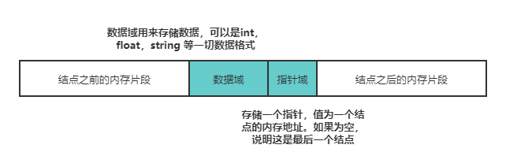
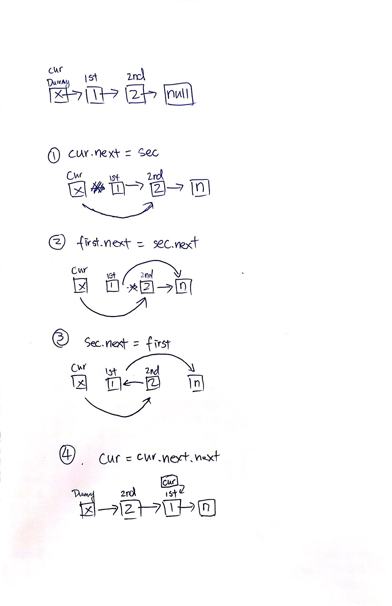

LinkedList总结：

1. 每一个linked list上的node都有两个属性，一个是val/node，另一个是next
2. 在不手动更改val的前提下，val的变化即意味着list node位置的变化，即当前的list node已经移动到另外一个node里了，这有点像一个萝卜一个坑。每一个node就是一个萝卜坑。而next则只是一个指针的方向，即预备的下一目的地，next类似于指南针，或者预瞄准

链表图解

一般来讲，链表中只会有一个结点的指针域为空，该结点为尾结点，其他结点的指针域都会存储一个结点的内存地址。链表中也只会有一个结点的内存地址没有存储在其他结点的指针域，该结点称为头结点。

链表的优点：链表的存储方式使得它可以高效的在指定位置插入与删除，时间复杂度均为 O(1)。
链表的劣势：无法高效获取长度，无法根据偏移快速访问元素，是链表的两个劣势。然而面试的时候经常碰见诸如获取倒数第k个元素，获取中间位置的元素，判断链表是否存在环，判断环的长度等和长度与位置有关的问题。这些问题都可以通过灵活运用**双指针**来解决。

解决linked list问题，绝大多数只需要搞定两个事情，一是当前list node的val，另一个就是node.next的指向对象
1. A = A.next 说明A node移动到了A.next所指的指针位置，即A真的有移动位置
2. A.next = B.next 说明A的下一个指针位置被定义到目前B的下一个指针所指的位置上，此时B的下一指针位置不变，但是A的下一指针位置变了，变成了B.next所指的位置
3. B=A.next 说明B的位置移动到了A的下一个指针位置，即B真的移动了位置，或者是新定义了B node的位置，总之B现在的位置就是A.next所指位置
4. A.next=B 说明改动A的下一个指针所指位置，把B设为A之后的下一个元素
5. 在linked list中，当 X.next处于等号左边时，表示（重新）定义X node的next指针方向。
6. 当 Y.next处于等号右边时，表示把Y node的next指针方向赋予给某node 或某node的next指针
7. 或移动了Y node：Y = Y.next

经典三指针互换list node position

   
求linked list 长度（length）
def len_link(list):
    temp=list.head
    count=0
    while(temp):
        count+=1
        temp=temp.next
    return count

快慢指针：
def findmid(linked_list):
    slow = fast = head
    while fast and fast.next:
        slow = slow.next
        fast = fast.next.next
        if slow == fast:
            return True
    return False
    return slow
