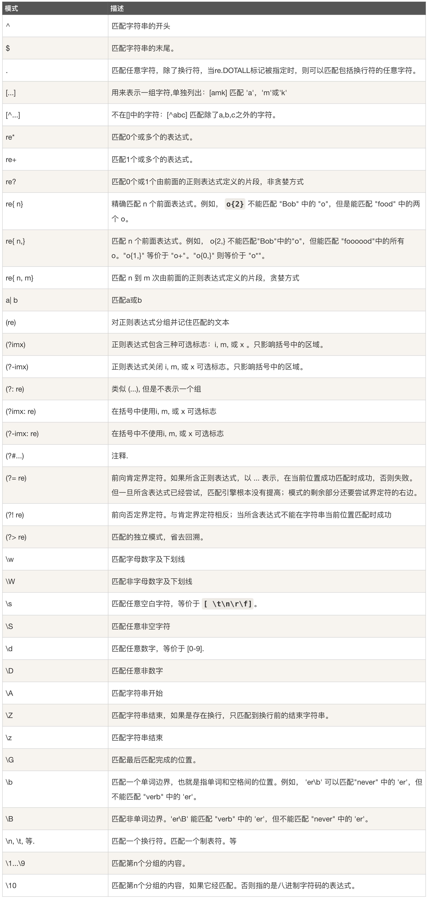
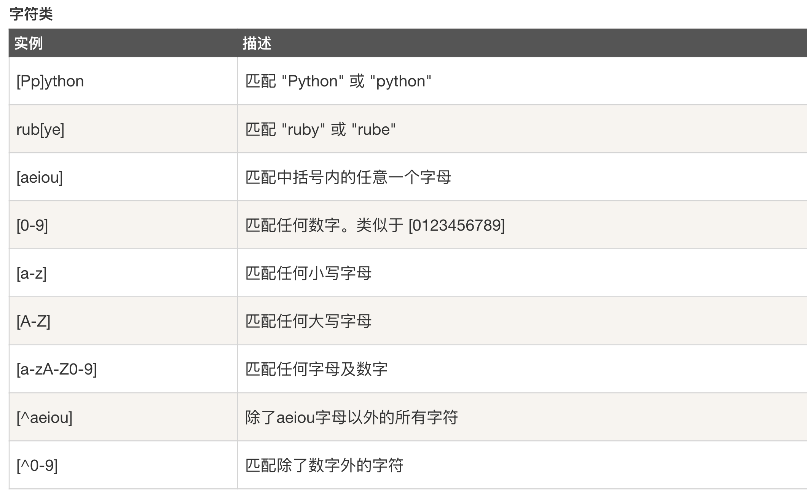
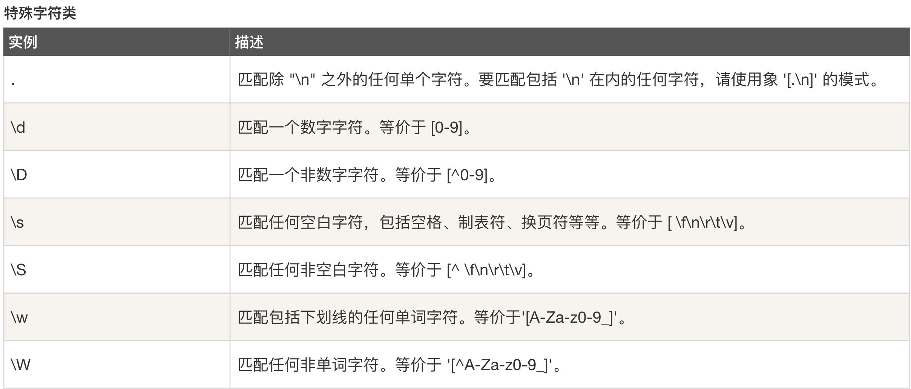

Python Regular Express as re 正则表达式总结

# 正则表达式的符号对应表格

# 正则表达式实例（字符类）

# 正则表达式实例（特殊字符类）

`import re`
`content = 'xxxxxx'`
`result = re(content,result)`

result 是一个object，即是一个class(类)
`result.groups()`会把所有的subgroup（从group(1)开始）以tuple的形式输出
`result.group(0)`得到的是原content，即被匹配的内容
`result.group(1)`会得到第一个匹配成功的字符串